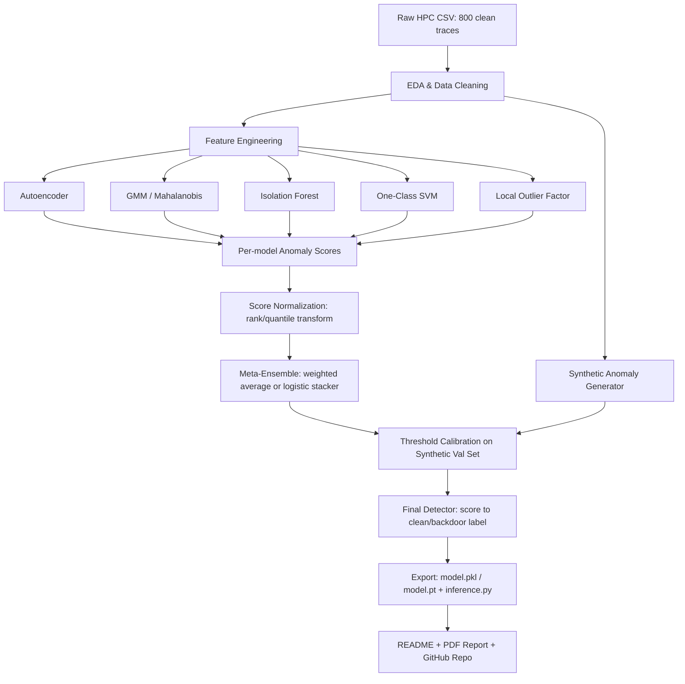

# IIT Kharagpur Hackathon 2026 — Implementation Plan
## Problem 1: Detection of Backdoor Attacks using Hardware Performance Counters (HPCs)

**Status:** Selected as primary/flagship problem
**Target:** Online phase submission (report + GitHub repo) — build to top-25 qualification standard

---

## 1. Why This Problem (Selection Rationale)

The site lists exactly two online-phase problems, and the rules actually require **both** to be solved for a complete online-phase submission — this plan focuses on Problem 1 as the primary, highest-leverage build (a short appendix for Problem 2 is included at the end so you don't lose those points).

Comparison of the two options:

| Factor | P1: HPC Backdoor Detection | P2: Black-Box Adversarial Attack |
|---|---|---|
| Data provided | Single CSV, 800 clean traces — small, clean, fast to iterate | 1000 images + 1MB-scale CNN, needs a live query loop |
| Compute cost | Low — trains in minutes on CPU | High — hard-label (no confidence scores) black-box attacks typically need thousands of queries *per image*; 1000 images can mean 1–10M forward passes |
| Ceiling on quality | High — this is a studied academic problem (see §2) with known strong methods you can combine into an ensemble | High but riskier — success-rate vs. imperceptibility is a harder joint optimization, and hard-label-only feedback (no scores) rules out easier score-based attacks like Square Attack |
| Fit with venue | Excellent — the onsite phase is co-located with the **Asian HOST conference** (Hardware Oriented Security and Trust), so hardware-security judges will likely rate this track closely | Good, but more of a generic adversarial-ML topic |
| Risk of a "broken" submission | Low | Higher — a badly-tuned decision-based attack can silently fail to converge on a chunk of images |

**Conclusion:** Problem 1 gives you the best shot at a genuinely "best-of-best" polished submission within limited hackathon time, because it's a small, well-defined unsupervised learning problem with a strong published research trail to build on and stand on the shoulders of. Build this one first and to full polish; use the appendix if time remains for Problem 2.

---

## 2. Deep Dive: The Problem, Grounded in Research

### 2.1 Restating the task precisely
- You get **800 rows of HPC traces from benign (clean) inferences only** — columns are named HPC types (e.g., cache references/misses, branch instructions/mispredictions, instructions retired, cycles, TLB misses, context switches — exact names depend on the CSV you download).
- No backdoor-trace examples are given — **this is strictly one-class / unsupervised anomaly detection**, not a two-class classifier.
- Your model will be scored against a **private set with both clean and backdoored traces**, using Accuracy, TPR, FPR, F1, and AUROC.
- This means your #1 design constraint is: **never assume you'll see anomalies during training** — the entire pipeline must be built and validated as if the positive class is invisible until grading time.

### 2.2 What the research literature says
This exact setup mirrors a real line of hardware-security research:
- A DATE 2024 paper on detecting backdoor attacks in black-box neural networks used **HPC side-channel signals** and a **Gaussian Mixture Model** fit on clean-inference HPC distributions, then flagged backdoor inputs using **negative log-likelihood** at inference time relative to that fitted distribution — an offline-fit / online-score anomaly detection design.
- A related IEEE Xplore paper on the same topic frames this as monitoring **microarchitectural data-flow dynamics** during inference: backdoor triggers change the *computational path* a network takes (e.g., extra/fewer active neurons or layers along the triggered path), and that shows up as a measurable shift in cache/branch/TLB counters even though the final output alone doesn't reveal it.
- Broader HPC-anomaly-detection literature (embedded software integrity checking, ransomware/malware detection, cloud anomaly detection) converges on a small set of proven modeling families: **HMMs/LSTMs on counter sequences, autoencoders scored by reconstruction error, and density/Mahalanobis-style models (GMM, one-class SVM, isolation forest)** — with autoencoders and GMMs repeatedly reported as the strongest single-model baselines, and **ensembles of these outperforming any one method alone**.

Full citations are in §11 — read at least the DATE 2024 paper before you start; it is the closest published analogue to this exact challenge and will directly justify your methodology in the report.

### 2.3 The engineering implication
Because you only have the "normal" class, your build has two intertwined jobs:
1. **Model the manifold of clean HPC behavior** as tightly and robustly as possible (several complementary models, ensembled).
2. **Build your own internal "backdoor-like" validation set** via principled synthetic anomaly injection, since you can't wait until grading day to find out if your detector actually works. This is the single highest-leverage thing separating a mediocre submission from a best-of-best one — most teams will skip it and tune blind.

---

## 3. Solution Architecture



**Design principle:** no single model family is trusted alone. Autoencoders catch complex nonlinear structure; GMM/Mahalanobis catch distributional shift cleanly; Isolation Forest and LOF catch local/sparse outliers that density models miss. Combining calibrated, rank-normalized scores from all five is the standard way published HPC-anomaly work beats any single method, and it also hedges you against not knowing exactly how the private backdoor traces will differ statistically.

---

## 4. Step-by-Step Build Procedure (feed these to your LLM/coding agent one phase at a time)

> Each phase below is written as a self-contained instruction block. If you're driving this with Claude Code or a similar coding agent, paste each "Agent Instructions" block as a prompt, verify the output, then move to the next phase. Don't skip phases — the synthetic validation set built in Phase 3 is what lets every later phase be tuned with real signal instead of guesswork.

### Phase 0 — Repository & Environment Setup
**Goal:** reproducible scaffold before touching data.

**Agent instructions:**
```
Create a Python project with this structure:
hpc-backdoor-detector/
├── data/               # raw + processed CSVs (gitignored except a small sample)
├── notebooks/          # EDA notebooks
├── src/
│   ├── data.py         # loading, cleaning, splitting
│   ├── features.py     # feature engineering
│   ├── models/
│   │   ├── autoencoder.py
│   │   ├── gmm.py
│   │   ├── iforest.py
│   │   ├── ocsvm.py
│   │   └── lof.py
│   ├── ensemble.py      # score fusion + stacking
│   ├── synth_anomaly.py # synthetic anomaly generators for internal validation
│   ├── evaluate.py       # Accuracy/TPR/FPR/F1/AUROC computation
│   └── infer.py           # single entrypoint: trace(s) -> label + score
├── models/               # saved artifacts (.pkl / .pt)
├── report/               # report.pdf source (markdown/LaTeX) + figures
├── README.md
├── requirements.txt
└── run_pipeline.sh       # one command: reproduce everything end-to-end
Use Python 3.10+, scikit-learn, PyTorch (for the autoencoder), pandas, numpy,
matplotlib/seaborn, and joblib for model persistence. Pin versions in requirements.txt.
Set a global random seed (e.g. 42) in every script for reproducibility.
```
**Deliverable:** empty-but-runnable scaffold, committed to git with an initial commit.

### Phase 1 — Exploratory Data Analysis (EDA)
**Goal:** actually understand the 800-row CSV before assuming anything.

**Agent instructions:**
```
Load the provided HPC CSV into src/data.py::load_raw_traces(). Then, in a notebook:
1. Print shape, column names/dtypes, and summary statistics (mean/std/min/max/quartiles).
2. Plot histograms and boxplots for every HPC column to check for skew, multi-modality,
   heavy tails, and near-constant columns (zero variance -> candidates to drop).
3. Compute and visualize a correlation heatmap across all HPC columns — highly
   correlated pairs (>0.95) are candidates for dimensionality reduction.
4. Check for missing values, obviously corrupt rows (negative counters, NaNs, inf),
   and duplicate rows.
5. Run PCA (2–3 components) and t-SNE/UMAP to visualize the clean-trace manifold —
   note any sub-clusters (these might correspond to different classes/inputs the
   traces were collected from, which matters for stratified splitting later).
6. Save all findings as commented markdown cells; this EDA notebook's key plots go
   straight into the report's "Data" section.
```
**Deliverable:** `notebooks/01_eda.ipynb` + a short written summary of data quirks.

### Phase 2 — Data Cleaning & Splitting
**Agent instructions:**
```
In src/data.py, implement:
- clean_traces(df): drop zero-variance columns, handle/flag missing or corrupt rows,
  cast dtypes, and de-duplicate.
- split_traces(df, val_frac=0.2, seed=42): if EDA revealed sub-clusters (e.g. distinct
  input classes), use stratified splitting so validation isn't accidentally
  distribution-shifted relative to train. Otherwise use a plain random split.
Keep at least 150-160 of the 800 clean rows fully held out as a clean-only
validation set (never touched during model fitting) — this becomes half of your
internal validation set in Phase 3.
```

### Phase 3 — Synthetic Anomaly Generation (the critical differentiator)
**Goal:** since no backdoor traces are given, manufacture a defensible internal
validation set so you can actually measure TPR/FPR/AUROC before submission instead
of hoping.

**Agent instructions:**
```
In src/synth_anomaly.py, implement multiple *independent* synthetic-anomaly families
so your validation isn't overfit to one corruption style. For each held-out clean
trace, generate perturbed variants using:
1. Feature-subset shift: pick a random subset of k columns (k = 10-30% of features,
   simulating "trigger touches only part of the compute path") and shift them by
   +/- (2 to 5) standard deviations (using train-set per-column std).
2. Global multiplicative noise: scale ALL columns by a random factor drawn from
   e.g. U(1.15, 1.6) or U(0.4, 0.85), simulating a globally heavier/lighter
   inference path.
3. Distributional resampling: for a random feature subset, resample values from the
   opposite tail of that feature's train-set empirical distribution (e.g. swap a
   value below the 10th percentile for one above the 90th).
4. Correlation-breaking shuffle: independently permute a few normally-correlated
   columns across different rows, breaking the joint structure while keeping each
   marginal distribution intact (this specifically stress-tests density models
   like GMM that rely on covariance structure, vs. per-feature checks that would miss it).
5. Mixup-style anomalies: blend two clean rows with an extreme mixing ratio
   (e.g. alpha in [0.7,0.9] taken from a *different* underlying input class if
   classes are identifiable) so the result sits off-manifold.
Label all synthetic rows as "synthetic_backdoor" and combine with the held-out
clean rows to build synth_val_set.csv (roughly 50/50 clean vs synthetic-anomaly).
Explicitly log, in the report, that this is a proxy validation set built because no
real backdoor traces were provided, and that final thresholds should be treated as
a starting point, not gospel, on the private grading set.
```
**Deliverable:** `synth_val_set.csv` + generation code, and a short note in the report
explaining exactly this limitation and mitigation.

### Phase 4 — Feature Engineering
**Agent instructions:**
```
In src/features.py, implement a FeatureBuilder that produces, on top of raw HPC
columns:
- Per-column z-score normalization (fit scaler on TRAIN split only).
- Ratio features between commonly-paired counters if present (e.g. cache-misses /
  cache-references, branch-mispredictions / branch-instructions) — these are
  hardware-security-literature-standard "rate" features that are more invariant to
  raw workload intensity than absolute counts.
- PCA-reduced feature block (fit on train only) to feed models sensitive to
  dimensionality/collinearity (GMM, OCSVM).
- Keep both a "full feature" view (for autoencoder/Isolation Forest, which handle
  high dimensionality fine) and a "reduced feature" view (for GMM/OCSVM, which
  degrade in high dimensions with only 800 samples).
Persist the fitted scalers/PCA to models/ so inference-time featurization is
identical to training-time.
```

### Phase 5 — Base Models
**Agent instructions:**
```
Implement each as a class with .fit(X_train), .score(X) -> anomaly_score (higher =
more anomalous), and .save()/.load():

1. src/models/autoencoder.py — a small fully-connected autoencoder (e.g.
   input -> 32 -> 8 -> 32 -> input, ReLU/LeakyReLU, dropout ~0.1) trained on
   z-scored TRAIN split with early stopping on the clean-only held-out subset
   (reconstruction loss, not the synthetic set — that's for calibration only,
   never for training). Anomaly score = per-sample reconstruction MSE.
2. src/models/gmm.py — GaussianMixture (2-5 components, chosen by BIC) fit on the
   reduced/PCA feature view. Score = negative log-likelihood under the fitted
   mixture (this directly mirrors the DATE 2024 paper's approach).
3. src/models/iforest.py — sklearn IsolationForest on the full feature view.
   Score = -decision_function (so higher = more anomalous).
4. src/models/ocsvm.py — One-Class SVM (RBF kernel, nu tuned via grid on the
   synthetic val set) on the reduced feature view.
5. src/models/lof.py — LocalOutlierFactor in novelty=True mode on the full feature
   view, for local-density anomalies the global models miss.
Log AUROC of each individual model against synth_val_set.csv so you can see which
families are actually pulling weight before building the ensemble.
```

### Phase 6 — Score Fusion / Ensemble
**Agent instructions:**
```
In src/ensemble.py:
1. Rank-normalize (or quantile-transform) each base model's raw anomaly scores to
   [0,1] using statistics computed on the TRAIN split, so scores are comparable
   across models with very different native scales.
2. Implement two fusion strategies and keep whichever wins on synth_val_set.csv:
   a) Weighted average — weights either uniform or tuned via a small grid/Bayesian
      search to maximize AUROC on the synthetic validation set.
   b) Stacked meta-classifier — a small logistic regression trained on
      [ae_score, gmm_score, iforest_score, ocsvm_score, lof_score] -> label, fit on
      synth_val_set.csv (this is legitimate here because synth_val_set is *not* the
      real private grading set, so this isn't overfitting to the actual test).
3. Report AUROC/F1 for: each base model alone, uniform average, weighted average,
   and stacked meta-classifier — this comparison table goes directly in the report
   and is a strong "we did the work" signal to evaluators.
```

### Phase 7 — Threshold Calibration
**Agent instructions:**
```
In src/evaluate.py:
1. Sweep thresholds on the fused score over synth_val_set.csv, plotting the ROC
   curve and computing AUROC.
2. Pick an operating threshold using a defensible rule stated explicitly in the
   report, e.g. "threshold at the point maximizing F1" or "threshold giving TPR>=0.9
   at the lowest achievable FPR" — pick based on which the evaluation rubric implies
   matters more (the rubric lists Accuracy, TPR, FPR, F1, AUROC as a set, so a
   balanced F1-max threshold is a safe default; also report the full ROC curve so
   evaluators can judge you at any operating point, since AUROC is threshold-free).
3. Because your calibration set is synthetic, also report sensitivity: how much
   does the chosen threshold move if you recalibrate against each *individual*
   synthetic-anomaly family from Phase 3 alone? Tight agreement across families is
   evidence your threshold will generalize to the unseen private set.
```

### Phase 8 — Finalize, Freeze, and Export
**Agent instructions:**
```
1. Retrain every base model + the ensemble on ALL 800 provided clean rows (no need
   to hold back data anymore once your methodology and threshold are finalized —
   more clean data only helps the final artifact).
2. Freeze all hyperparameters found in Phases 5-7 into a single config.yaml.
3. Implement src/infer.py::predict(csv_path) -> DataFrame[trace_id, anomaly_score,
   label] as the single, simple entrypoint an evaluator can run.
4. Save all final artifacts (scalers, PCA, each base model, the meta-classifier or
   fusion weights, the chosen threshold) into models/ with joblib/torch.save.
5. Write a smoke test: run infer.py on a few held-out clean rows and confirm all
   are labeled "clean" with low anomaly scores, as a sanity check before submission.
```

### Phase 9 — Documentation & Report
**Agent instructions:**
```
1. README.md must include: problem restatement, environment setup, exact commands
   to reproduce training end-to-end (run_pipeline.sh), exact command to run
   inference on a new CSV, and a results summary table (Accuracy/TPR/FPR/F1/AUROC
   on the internal synthetic validation set, clearly labeled as internal/proxy
   metrics, not the private grading numbers).
2. report.pdf (2-4 pages) must cover: problem framing, EDA highlights, feature
   engineering rationale, each base model with one-line justification, the fusion
   strategy and why it beat single models, the synthetic-anomaly validation
   methodology (this is your strongest differentiator — explain it clearly, since
   it's what proves the offline choices weren't guesswork), threshold selection
   rationale, and 2-3 sentences of explicit limitations (proxy validation only;
   real backdoor traces may differ in ways your synthetic families didn't cover).
3. Cite the DATE 2024 HPC/GMM backdoor-detection paper and 1-2 of the HPC anomaly
   detection papers referenced in §11 as methodological grounding — reviewers will
   recognize you did real research rather than guessing an architecture.
```

### Phase 10 — Submission Checklist
- [ ] GitHub repo is public (or accessible to organizers) and contains complete, runnable code with finalized parameters (no leftover TODOs).
- [ ] Saved detector model + `config.yaml` committed (via Git LFS if large).
- [ ] README lets a stranger reproduce your pipeline from a clean clone in under ~10 minutes.
- [ ] `report.pdf` present, 2-4 pages, matches the actual final pipeline (not an earlier draft).
- [ ] `infer.py` runs end-to-end on a fresh CSV with the same column schema and produces per-row labels/scores.
- [ ] Google Form submitted with correct repo link before the deadline.

---

## 5. Model Zoo Summary (why each model earns its place)

| Model | Catches | Weakness alone |
|---|---|---|
| Autoencoder | Complex nonlinear structure, subtle multi-feature co-shifts | Needs enough data to not just memorize (mitigate with dropout + early stopping) |
| GMM (neg. log-likelihood) | Global distributional shift; directly mirrors the DATE'24 published method | Struggles in high dimensions with only 800 samples — feed it the PCA-reduced view |
| Isolation Forest | Sparse/rare local outliers, robust to feature scale | Can miss anomalies that only appear in *joint* correlation structure |
| One-Class SVM | Tight nonlinear boundary around the normal manifold | Sensitive to kernel/nu choice; tune against synthetic val set |
| Local Outlier Factor | Local density anomalies missed by global models | Sensitive to neighborhood size k; tune against synthetic val set |

---

## 6. Common Pitfalls to Avoid
1. **Fitting scalers/PCA on the full dataset before splitting** — always fit only on train, to avoid leaking validation statistics.
2. **Using the synthetic anomaly set to pick your neural network architecture** (fine) **but also to early-stop the autoencoder's *reconstruction* training** (not fine — that leaks "anomaly-like" signal into what should be a clean-only reconstruction objective; early-stop on clean held-out loss instead).
3. **Only building one anomaly family for synthetic validation** — a model can look excellent against one corruption style and fail completely against the real private set's actual shift pattern. Multiple independent families (Phase 3) hedge this.
4. **Reporting only accuracy** — with class imbalance likely in the private set, accuracy alone can be misleading; always report the full metric suite the rubric asks for, plus the ROC curve.
5. **Forgetting reproducibility** — set and document every random seed; evaluators may re-run your code.

---

## 7. Effort/Timeline Estimate (for a small team, hackathon pace)

| Phase | Est. time |
|---|---|
| 0-1 Setup + EDA | 2-3 hrs |
| 2-4 Cleaning, synthetic anomalies, features | 3-4 hrs |
| 5-6 Base models + ensemble | 4-6 hrs |
| 7-8 Calibration + finalize | 2-3 hrs |
| 9-10 Docs, report, submission | 2-3 hrs |
| **Total** | **~1.5-2 focused days**, leaving time for Problem 2 |

---

## 8. Stretch Goals (if time remains, for a genuinely best-of-best entry)
- Add a **sequence-aware model** (1D-CNN or small LSTM autoencoder) if the HPC CSV turns out to have a temporal/sequential structure per-inference (e.g., multiple time-windowed readings per inference) rather than one flat feature vector per row — this would let you directly mirror the HMM/LSTM literature in §2.2.
- Add **SHAP or permutation-importance** analysis on the ensemble to identify *which* HPCs drive detections — a strong hardware-security-flavored addition that plays well with the HOST-conference audience.
- Add **calibrated probability outputs** (Platt scaling / isotonic regression on the fused score) so the detector reports a defensible confidence, not just a hard label.
- Add a small **ablation table** in the report (each base model in/out of the ensemble, effect on AUROC) — cheap to produce, very convincing to judges.

---

## 9. Appendix A — Data Access
- Trace CSV: https://drive.google.com/drive/folders/1NJaH4AmXhL_YJgLqfGs6Xo9_NNAVgqwI?usp=sharing
- Submission form: https://forms.gle/xVewhvxGuqf3agp16
- Download the CSV first and actually run Phase 1's EDA before finalizing feature engineering in this plan — the exact column names/semantics will refine several of the "if present" branches above.

---

## 10. Appendix B — Quick Plan for Problem 2 (Black-Box Adversarial Attack), if pursuing both
Since online-phase rules require solving **both** problems, here is a condensed plan once Problem 1 is polished:

1. **Setup:** load the shared `.pt` CNN and 1000 clean images from the provided notebook; confirm you only ever call the model's `argmax` output (hard-label only — no confidence scores allowed per the rules).
2. **Baseline decision-based attack:** implement **HopSkipJumpAttack** or **RayS** (both are hard-label-only, well-published, and have reference implementations you can adapt) as your first working pipeline — get *some* adversarial image for every input before optimizing quality.
3. **Efficiency layer:** add a **surrogate-model gradient prior** (train or download a small CNN on a similar public dataset) to warm-start the search direction per HopSkipJumpAttack/GreedyPixel-style approaches — this cuts query counts substantially, which matters given the 50% weight on imperceptibility (smaller, better-guided perturbations) and the tie-break on fewer queries.
4. **Imperceptibility tuning:** cap perturbation via an L2 or L_inf budget, and after finding any successful adversarial point, run a **binary-search / projection step** to shrink the perturbation back toward the decision boundary (standard in HopSkipJumpAttack and Boundary Attack) to minimize visible noise.
5. **Batch and parallelize:** run all 1000 images through a query-budgeted loop (e.g., 2,000-5,000 queries/image cap) with early stopping once a perturbation is both successful and under your target norm budget; log per-image query counts for the tie-break criterion.
6. **Evaluate before submitting:** compute your own attack success rate and average perturbation norm (L2/L_inf and SSIM/LPIPS vs. clean image) locally so you know your standing before the private evaluation.
7. **Report:** describe the algorithm, query budget, and imperceptibility metric explicitly — this problem's rubric rewards a clearly justified trade-off, not just a working attack.

*(This appendix is intentionally condensed — ask for a full phase-by-phase plan in the same depth as Problem 1 if/when you're ready to build it.)*

---

## 11. References (background reading before you start)
1. *Detecting Backdoor Attacks in Black-Box Neural Networks through Hardware Performance Counters* — DATE 2024 (GMM + HPC negative-log-likelihood method; closest published analogue to this challenge). https://past.date-conference.com/proceedings-archive/2024/DATA/1142_pdf_upload.pdf
2. *Detecting Backdoor Attacks in Black-Box Neural Networks through Hardware Performance Counters* — IEEE Xplore version (hard-label black-box framing, data-flow-dynamics motivation). https://ieeexplore.ieee.org/document/10546739/
3. *Hardware Performance Counters for Embedded Software Anomaly Detection* — HMM/LSTM approach on HPC traces. https://ieeexplore.ieee.org/document/8511944/
4. *Hardware Performance Counters for Anomaly Detection in Embedded Devices* (Springer) — survey-style coverage of HPC-based anomaly/malware/ransomware detection. https://link.springer.com/chapter/10.1007/978-3-032-16165-9_23
5. *CloudShield: Real-time Anomaly Detection in the Cloud* — reconstruction-error-based HPC anomaly detection (autoencoder framing) and discussion of why unsupervised methods matter for zero-day-style detection. https://arxiv.org/pdf/2108.08977
6. HopSkipJumpAttack (hard-label decision-based attack) — IEEE S&P 2020, referenced via SoK: Pitfalls in Evaluating Black-Box Attacks. https://arxiv.org/pdf/2310.17534
7. RayS: A Ray Searching Method for Hard-label Adversarial Attack — KDD 2020 (efficient hard-label attack, useful for Appendix B). Referenced in the SoK above.

---

*Prepared as a self-contained brief for driving an LLM coding agent phase-by-phase through the full build. Re-run Phase 1's EDA the moment the real CSV is downloaded and adjust feature-engineering specifics (§Phase 4) to match the actual column set before proceeding.*
