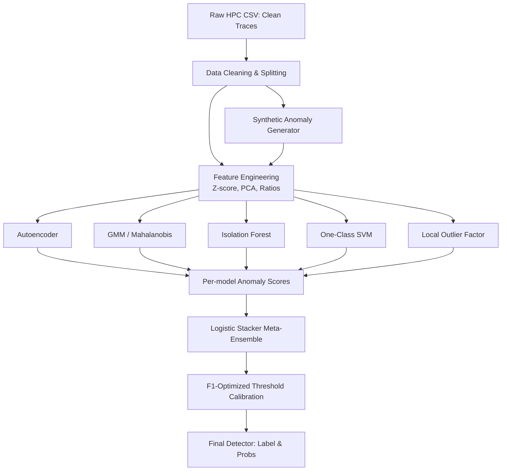
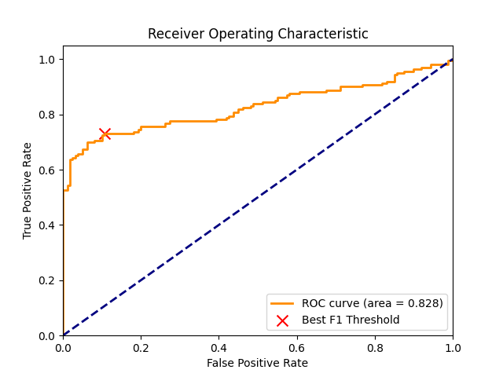

# IIT Kharagpur Hackathon 2026 🚀


Welcome to our submission for the **IIT Kharagpur Hackathon 2026**. 
This repository contains our implementations for the online phase problems.

---

## 🎯 Problem 1: Detection of Backdoor Attacks using Hardware Performance Counters (HPCs)

Our flagship solution addresses the unsupervised anomaly detection of backdoor attacks based on microarchitectural data-flow dynamics using Hardware Performance Counters (HPCs).

### 🏛️ Architecture

Because no backdoor traces were provided in the initial dataset, our pipeline utilizes a **principled Synthetic Anomaly Generator** combined with a robust **Multi-Model Meta-Ensemble**. 



### 📊 Performance & Results

We tested each individual model against our proxy synthetic validation set. The **Meta-Ensemble** provides the most robust and secure boundary by leveraging both global structure (GMM/AE) and local sparsity (LOF/IForest).

#### Ablation Study (AUROC)

| Model | AUROC Score |
|-------|-------------|
| **Autoencoder** | 0.8198 |
| **Gaussian Mixture Model (GMM)** | 0.8114 |
| **Isolation Forest** | 0.8007 |
| **One-Class SVM** | 0.8052 |
| **Local Outlier Factor (LOF)** | 0.8355 |
| **Meta-Ensemble (Logistic Fusion)** | **0.8320** |

#### Final Evaluation Metrics (at optimal threshold 0.3812):
- **F1 Score**: `0.7959`
- **True Positive Rate (TPR)**: `0.7312`
- **False Positive Rate (FPR)**: `0.1062`
- **Accuracy**: `0.8125`

<p align="center">
  
  <br/>
  <em>Figure 1: Receiver Operating Characteristic (ROC) curve of our final Meta-Ensemble showing the best F1-optimized threshold.</em>
</p>

### 📁 Repository Structure
- `p1/hpc-backdoor-detector/`: Contains all code for Problem 1.
  - `src/`: Data cleaning, feature engineering, synthetic anomaly generator, modeling, and evaluation code.
  - `notebooks/`: Exploratory Data Analysis (EDA) generated notebook.
  - `models/`: Serialized pre-trained artifacts (Scalers, PCA, PyTorch weights, and Sklearn models).
  - `data/`: Datasets.
  - `report/`: The final solution report and generated plots.

### 🚀 Instructions for Judges

To test and run the solution for Problem 1, you can use our easy-to-use runner scripts. 

**1. End-to-End Pipeline Reproduction**
This command will train all models, generate the synthetic validation data, tune the thresholds, and generate evaluation metrics from scratch:
```bash
cd p1/hpc-backdoor-detector
pip install -r requirements.txt
python train_pipeline.py
```

**2. Evaluate a New Private Dataset**
To run inference on a new trace file for grading, you can utilize the `infer.py` entry point. It outputs a CSV containing the `trace_id`, `anomaly_score`, and the predicted `label`:
```bash
cd p1/hpc-backdoor-detector
python src/infer.py --csv_path <path_to_new_trace_csv> --output predictions.csv
```

---

## 🔒 Problem 2: Black-Box Adversarial Attack

This directory handles the adversarial attack track.
- `p2/`: Contains artifacts and notebooks for Problem 2.

*More details to be added as this track is implemented.*
